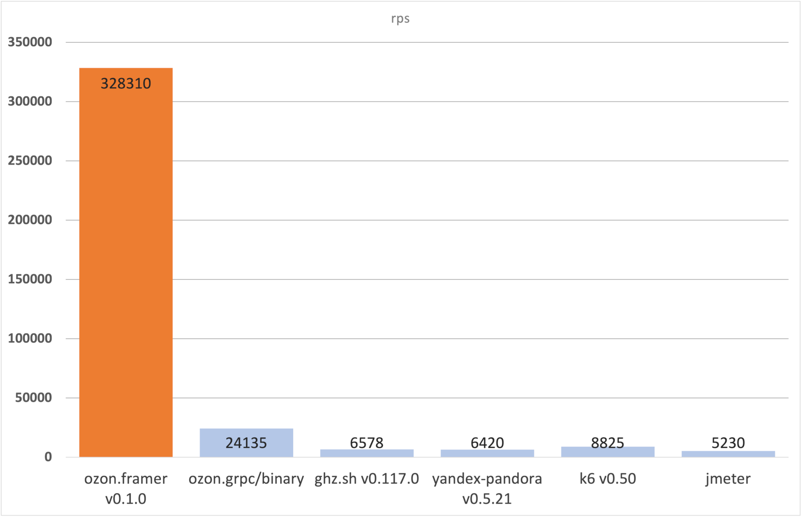

# framer
framer is the most performant grpc load generator

## Performance


Load generators was limited in 2 CPU.
Load generators configurations are available in [benchmarks directory](./benchmarks)

### How we achive this performance values?
* We have created simple http/2 & grpc client from scratch with performance in mind;
* Project follows zero-allocation concept;
* Syscalls count minimized;
* Data copying minimized;

## Disclaimer
This is alpha version. Public api and request file format may be changed.

## Install
Download binary from [github release page](./releases/latest) and place it in your PATH.

### Compile
**Build using go**

```sh
git clone https://github.com/ozontech/framer
cd framer/cmd/framer
go build . -o framer
./framer --help
```

**Install using go**
```sh
go install github.com/ozontech/framer/cmd/framer@latest
```

**Run using docker**
```sh
git clone https://github.com/ozontech/framer
cd framer
docker -v build --tag framer .
docker run --network host -v $(pwd)/test_files/requests:/requests framer load --addr=localhost:9090 --requests-file=test_files/requests --clients 10 const 10 --duration 10s
```

## Load generation
### Usage
```
Usage: framer load --addr=STRING --requests-file=REQUESTS-FILE <rps> [flags]

Starting load generation.

Flags:
  -h, --help                           Show context-sensitive help.

      --addr=STRING                    Address of system under test
      --requests-file=REQUESTS-FILE    File of requests in ozon.binary format (see convert command to generate)
      --inmem-requests                 Load whole requests file in memory.
      --clients=1                      Clients count.
      --phout=STRING                   Phout report file.

RPs:
  const           Const rps.
    <freq>        Value req/s.

  line            Linear rps.
    <from>        Starting req/s.
    <to>          Ending req/s.
    <duration>    Duration (10s, 2h...).

  unlimited       Unlimited rps (default one).
```

### Example
```sh
framer load --addr=localhost:9090 --requests-file=test_files/requests --clients 10 const 10 --duration 10s
```
It makes 10 rps from 10 clients in 10 second.

## Converter
### Ozon.binary file format
Rules are using [ABNF syntax](https://tools.ietf.org/html/rfc5234).

```abnf
Requests = 1*Request
Request = Length LF RequestPayload LF
Length = 1*DIGIT; Size of RequestPayload in bytes, represented as ascii string
RequestPayload = TagLine PathLine HeadersLine Body
TagLine = 1*CHAR LF
PathLine = 1*CHAR LF
HeadersLine = Headers LF
Headers = {json encoded object with followed structure {"key1": ["val1.1", "val1.2"], "key2": ["val2.1"]}}; keys started with ":" will be ignored
Body = 1*({any byte})
```

[Example requests file](https://github.com/ozontech/framer/-/blob/master/test_files/requests)

### Usage
```
Usage: framer convert --help
Usage: framer convert --from=ozon.json --to=ozon.binary [<in> [<out>]] [flags]

Converting request files.

Arguments:
  [<in>]     Input file (default is stdin)
  [<out>]    Input file (default is stdout)

Flags:
  -h, --help              Show context-sensitive help.

      --from=ozon.json    Input format. Available types: ozon.json, ozon.binary, pandora.json
      --to=ozon.binary    Output format. Available types: ozon.json, ozon.binary

Reflection flags:
  --reflection-addr=my-service:9090                       Address of reflection api
  --reflection-proto=service1.proto,service2.proto,...    Proto files
  --reflection-import-path=./api/,./vendor/,...           Proto import paths
```

### Example
```sh
framer convert --from=ozon.json --to=ozon.binary --reflection-proto=formats/grpc/ozon/json/encoding/testproto/service.proto formats/grpc/test_files/requests.ozon.json
```
It converts requests file from ozon.json format to ozon.binary format using protofile.

### Programatic requests generation example
[Full example](./examples/requestsgen)

## TODO
- [ ] Installation from homebrew for macOS;
- [ ] Publish to dockerhub;
- [ ] Configuration file support;
- [ ] Requests scheduling strategys combination;
- [ ] More reporting variants;
- [ ] More performance:
    - [ ] Batch frames to multiple tcp connections using linux aio.h (minimize syscalls); May help keep performance with hundreds connections;
    - [ ] Faster hpack encoding/decoding;
    - [ ] More performant requests file structure;
- [ ] Extensibility:
    - [ ] Requests middleware (for injecting token, for example);
    - [ ] Ability to use custom client-side load balancer and discoverer;
    - [ ] Custom reporters;
    - [ ] Plugin system
